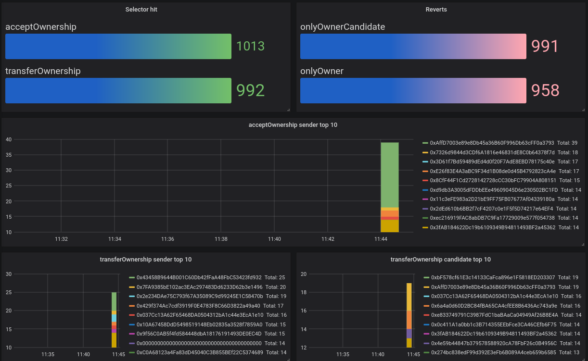

## Metrics demo
- collect forge campaign metrics for [TransferSequenceWithMetrics](TransferSequenceWithMetrics.t.sol) invariant test (2 step ownership transfer test)
- recorded metrics are
  - number of times a selector was called
  - count of reverts (per revert type) during campaign
  - adresses fuzzed in campaign and number of times they were used (per selector)
- metrics are displayed in Grafana dashboard

### Setup
- start OTEL collector and carbon/Grafana dashboard by running `docker-compose up` (OTEL collector is configured to write metrics in file and send to carbon endpoint, see `exporters: [file, carbon]` config in [otel-collector-config.yaml](otel-collector-config.yaml) file)
- import [Forgetest-sample.json](Forgetest-sample.json) dashboard in Grafana (localhost:80)
- run `forge test --mt invariant_record_metrics`
- to see metrics in file `tail -f sample.json`
- Grafana should show a dashboard as
  


- metrics are recorded by using `vm.incrementMetrics` cheatcode
- increment selector count:
```Solidity
  vm.incrementMetrics("transferOwnership.count");
```
- increment `sender` parameter count:
```Solidity
  vm.incrementMetrics(
    string.concat("transferOwnership.sender.", vm.toString(sender))
  );
```
- increment revert count:
```Solidity
  try owned.transferOwnership(candidate) {} catch {
    vm.incrementMetrics("transferOwnership.reverts.onlyOwner.count");
  }
```